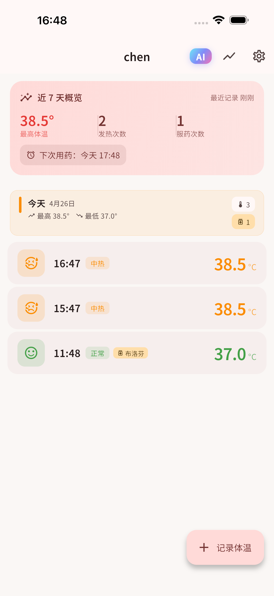
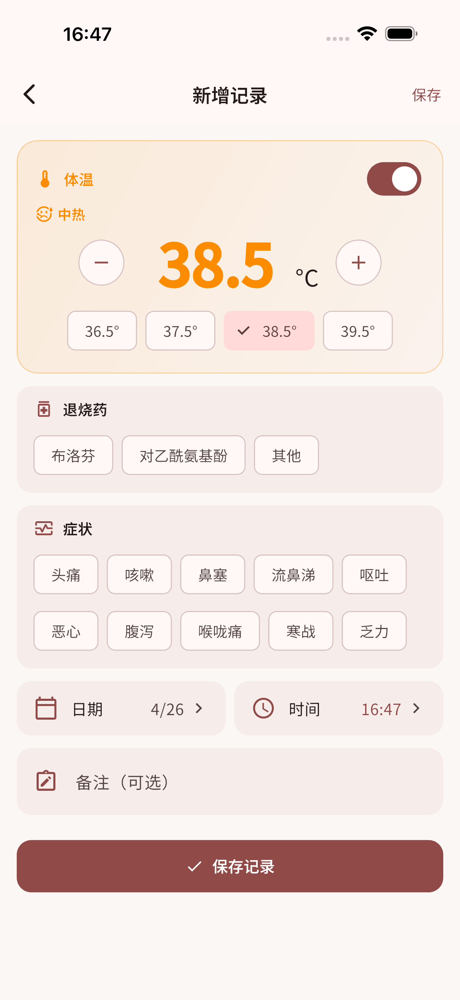
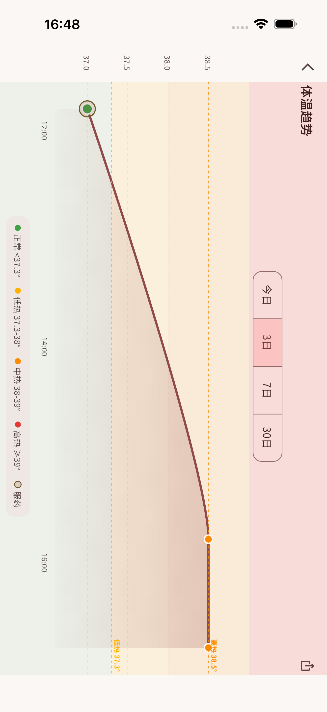
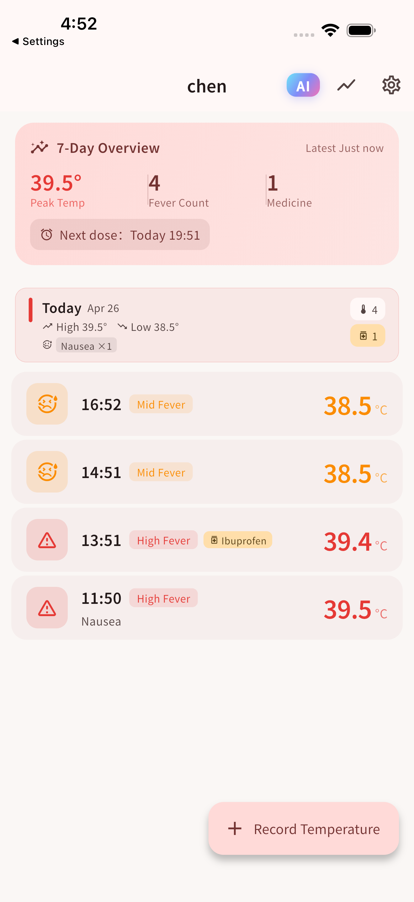
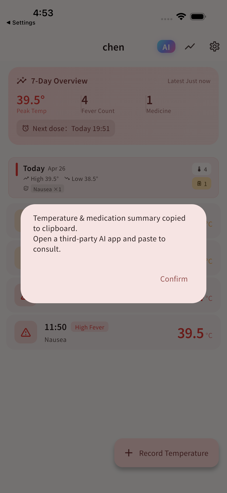
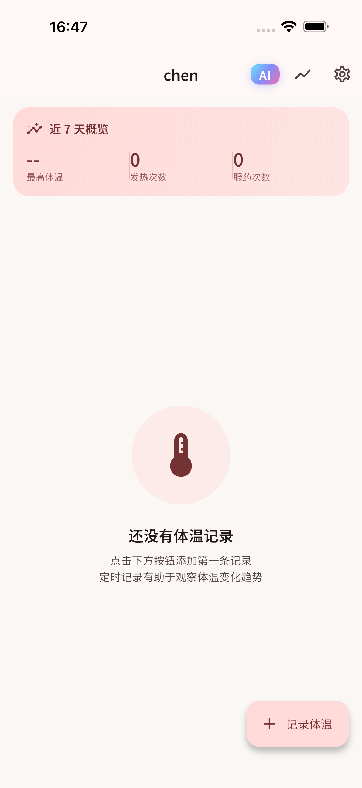
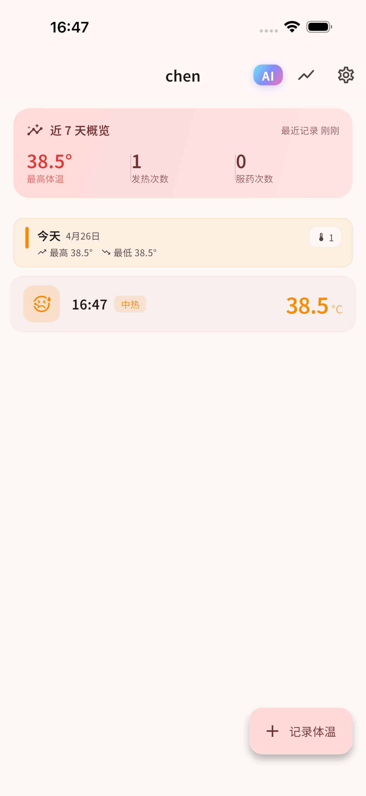
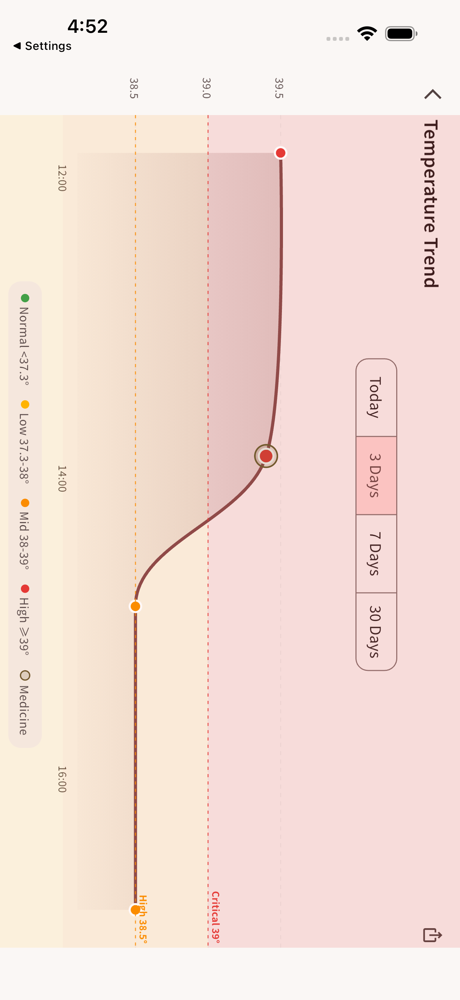

# EverTemp — Temperature Tracker & Fever Log

  
  
  
  
  

  <strong>体温记录 · 趋势分析 · 用药提醒</strong> 
  专为家长和患者设计，轻松追踪发烧全过程

---

## 功能 Features

| | |
|---|---|
| 📋 **多人档案** | 为家中每位成员创建独立档案，一个 App 管全家 |
| 🌡️ **快速录入** | 精准体温输入 + 症状勾选 + 退烧药选择，一屏完成 |
| ⏰ **用药提醒** | 服药后自动计算下次用药时间，本地通知准时提醒 |
| 📈 **趋势图表** | 横屏折线图，正常/低烧/中烧/高烧颜色分级，一目了然 |
| 📊 **7天概览** | 实时展示峰值体温、发烧次数、服药次数、下次用药时间 |
| 🤖 **AI 咨询** | 一键将体温摘要复制并跳转 AI 应用咨询，数据不离设备 |
| 📄 **PDF 导出** | 生成含体温曲线图的报告，方便就医时分享 |
| 🌙 **深色模式** | 完整支持系统深色 / 浅色模式自动切换 |
| 🌐 **多语言** | 简体中文 · 繁体中文 · English · 日本語 |

---

## 截图 Screenshots

### 中文界面

  
  
  
  
  

### English Interface

  
  
  

---

## 隐私 Privacy

所有数据仅保存在您的设备本地，不会上传至任何服务器。  
All data is stored **locally on your device only** and never uploaded to any server.

AI 咨询功能通过剪贴板传递摘要文本，由用户自行选择使用哪款 AI 应用。  
The AI feature copies a text summary to your clipboard — you choose which AI app to use.

---

## 支持 Support

遇到问题或有功能建议，请在 **[Issues](https://github.com/levili-T/EverTemp/issues)** 提交反馈。  
For bug reports or feature requests, please open an **[Issue](https://github.com/levili-T/EverTemp/issues)**.

---

## 开发技术栈

- **Flutter** 3.22+ / Dart 3.4+
- `sqflite` — 本地 SQLite 数据库
- `fl_chart` — 体温趋势折线图
- `flutter_local_notifications` — 用药提醒通知
- `provider` — 状态管理
- `pdf` + `printing` — PDF 报告导出
- `flutter_slidable` — 滑动操作

---

Made with ❤️ for families

